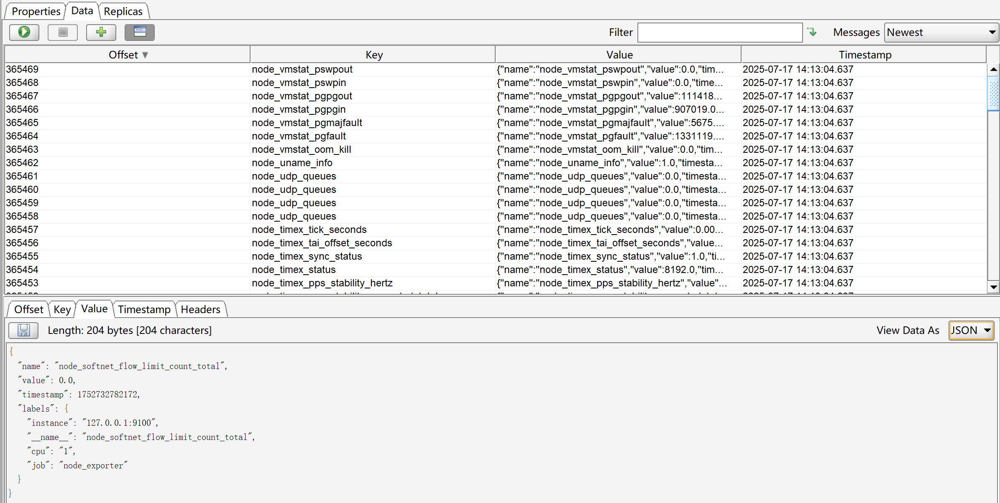

# Mica-Prometheus-Write

Mica-Prometheus-Write 是一个用于处理 Prometheus 远程写入请求的 Java 实现项目（目前支持写入 kafka）。该项目主要用于接收 Prometheus 的远程写入数据，解码并处理这些数据，可以用于构建 Prometheus 数据的存储后端或转发服务。

---

🎉🎉🎉**推广**🎉🎉🎉 [**BladeX 物联网平台(「mica-mqtt加强版」+「EMQX+Kafka插件」双架构)**](https://iot.bladex.cn?from=mica-mqtt)

## ✨ 项目特点

- 支持 Prometheus 远程写入 v1 和 v2 版本协议。
- 提供基于 Protobuf 的数据结构，用于解析和构建 Prometheus 的写入请求。
- 提供 HTTP 接口处理 Prometheus 的远程写入请求。
- 包含 Snappy 压缩解压工具，支持解压远程写入数据。
- 提供详细的 MetricMetadata、TimeSeries、Sample
- 支持扩展，可轻松集成到其他存储系统或数据转发服务中。

## 🏗 安装

项目使用 Maven 构建，可以直接通过以下命令进行构建：

```bash
mvn clean package
```

然后直接运行 `java -jar mica-prometheus-write-server.jar` 即可，配置支持 jar 同级目录 `config.properties` 或 `config/config.properties`，也支持环境变量。

`config.properties` 配置示例详见：[config.properties](mica-prometheus-write-server/src/test/resources/config.properties)

## 🔧 配置（prometheus.yml）

```yml
# 开启远程写出
remote_write:
    - url: "http://127.0.0.1:8080/write"
#      protobuf_message: io.prometheus.write.v2.Request # 开启 v2 版，消息更加紧凑，默认：prometheus.WriteRequest v1版
#      basic_auth:  # 开启基础认证
#          username: xxxxxx
#          password: xxxxxx
```

注意：更多配置请查看：https://prometheus.io/docs/prometheus/latest/configuration/configuration/#remote_write

## 🎨 效果展示



## 🍻 我的开源
- `mica-mqtt` 简单易用的 Java mqtt 客户端和服务端：[https://gitee.com/dromara/mica-mqtt](https://gitee.com/dromara/mica-mqtt)
- `mica` Spring Cloud 微服务开发核心工具集：[https://gitee.com/596392912/mica](https://gitee.com/596392912/mica)
- `mica-auto` 自动生成 java spi 和 Spring boot 的配置：[https://gitee.com/596392912/mica-auto](https://gitee.com/596392912/mica-auto)
